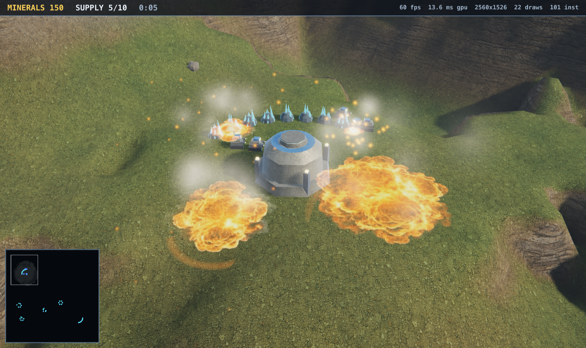
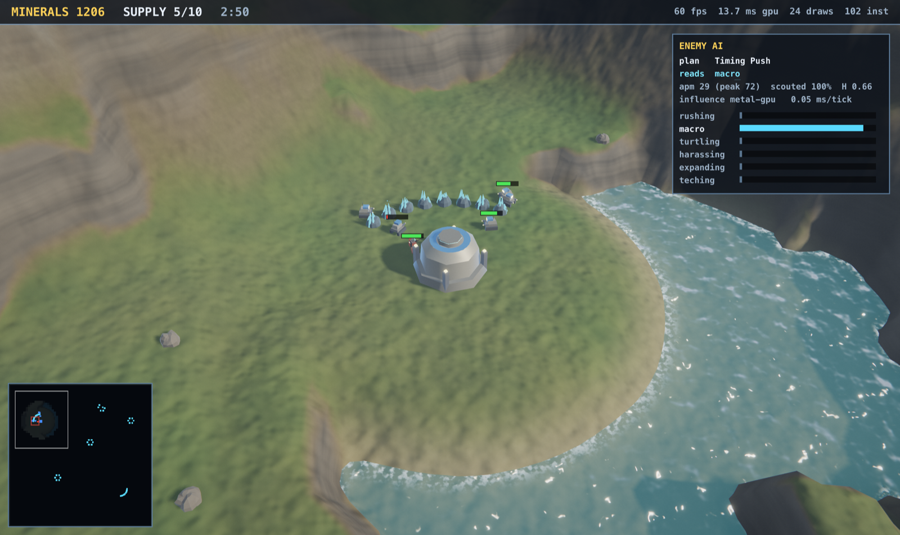

# Starforge

A 3D real-time strategy game in C++ for Apple Silicon Macs. StarCraft-style base
building, resource gathering and combat, rendered with a modern Metal pipeline.

Zero external dependencies — no SDL, no CMake, no Homebrew packages, no engine.
Just `make`.



## Requirements

- An Apple Silicon Mac (arm64)
- Xcode **Command Line Tools** — full Xcode is *not* required:
  ```bash
  xcode-select --install
  ```

The Metal shaders are compiled from source at launch via `newLibraryWithSource:`,
so the offline `metal` compiler (which only ships with full Xcode) is never needed.

## Build and run

```bash
make && ./starforge
```

## Controls

| | |
|---|---|
| **Camera** | Push the pointer against any screen edge to pan, or use the arrow keys · `Q`/`E` rotate · scroll wheel zooms |
| **Display** | Starts full screen · `Ctrl`+`Cmd`+`F` toggles · `--windowed` starts windowed |
| **Select** | Left-click, or drag a box · double-click selects all of that type on screen · `Shift` adds |
| **Groups** | `Ctrl`+`0`–`9` assigns a control group · `0`–`9` recalls it |
| **Orders** | Right-click to move / attack / harvest · `A` attack-move · `S` stop · `H` hold · `Space` centres on selection |
| **Build** | Select a Digger, then `B` bunkhouse · `F` foundry · `G` garrison · `W` workshop, then click to place |
| **Train** | Select a structure, then `D` digger · `T` trooper · `M` mauler |
| **Rally** | Right-click with only structures selected |
| **Menu** | `Esc` opens the in-game menu (resume, restart, full screen, quit) |
| **Other** | `/` toggles help · `I` opens the AI inspector · `P` pauses · `,`/`.` change game speed · `R` restarts after a match ends |

Hovering any command card button shows its cost, supply, build time and what it
does; the ore price is also printed on the face of the button, since that is
the one number you check constantly.

`Esc` unwinds one step at a time — first a pending building placement, then the
selection, and only with nothing left to cancel does it open the menu. Anything
else would swallow the cancel you reach for mid-order. While the menu is up the
simulation is frozen and the rest of the input is ignored, so a stray click
cannot order units around behind the panel.

Camera panning is on the arrow keys rather than WASD so that the letter keys stay
free for commands, the way the original StarCraft binds them.

Edge scrolling uses a 24-point band with the speed ramping from 35% at the inner
boundary to full at the screen edge, so a nudge creeps and a shove sprints. It is
suppressed while the pointer is over the minimap or the command card — the two
HUD panels you actually click, both of which sit in a corner. The top info bar is
deliberately *not* treated as blocking, since it spans the full width and would
otherwise disable upward scrolling entirely.

The game starts full screen; benchmarks and screenshots (`--bench`, `--shot`)
stay windowed so their numbers remain comparable between runs.

Full screen is a **borderless window**, not AppKit's native full screen mode.
Native full screen keeps the menu bar and the title bar one mouse-move from the
top of the display, which is unusable here: pushing the pointer at the top edge
is how you pan the camera north, so the system chrome would drop down constantly.
The borderless window has no title bar to reveal, and `NSApplicationPresentation`
`HideMenuBar` (rather than `AutoHideMenuBar`) stops the menu bar coming back.
`--fs-debug` prints the resulting style mask and presentation options.

## Playing

Mine ore with Diggers, raise your supply cap with Bunkhouses, and build an
army. You win by destroying every enemy structure and Digger; you lose if you lose
all of yours. Every build hotkey is the first letter of its name.

| Unit | Cost | Supply | HP | Role |
|---|---|---|---|---|
| Digger | 50 | 1 | 60 | Harvests ore, constructs buildings |
| Trooper | 50 | 1 | 55 | Cheap ranged infantry |
| Mauler | 150 | 3 | 180 | Slow, long range, splash damage |

| Structure | Cost | HP | Provides |
|---|---|---|---|
| Foundry | — | 1500 | Trains Diggers, ore drop-off, +10 supply |
| Bunkhouse | 100 | 400 | +8 supply |
| Garrison | 150 | 1000 | Trains Troopers |
| Workshop | 200 | 1250 | Trains Maulers |

The enemy AI runs a real build order — workers first, bunkhouses when supply-blocked,
garrison then workshop — and sends attack waves that grow each time.

## How it works

```
src/
  core/     Math.h        column-major vectors and matrices
            Random.h      xorshift PRNG, value noise, fBm, ridged noise
  sim/      Terrain.*     terraced heightmap, cliffs, carved ramps, water, minimap
            Nav.*         grid A* with string-pulled path smoothing
            Game.*        entities, orders, combat, economy, production, enemy AI
  gfx/      MeshGen.*     procedural geometry, and the model-pack loader
            ModelPack.h   on-disk layout of assets/models.bin
            Shaders.h     the whole Metal shading language source
            Renderer.*    the Metal backend
  ai/       AI.h          the whole adaptive-opponent architecture
            Brain.cpp     action budget, fog-limited perception, opponent model
            Strategy.cpp  influence fields + online strategy selection
            Commander.cpp macro, scouting, tactics, micro
            InfluenceMapGPU.mm  Metal compute backend for the spatial fields
tools/    mesh_check.cpp      offline audit of the mesh library (no GPU needed)
          mesh_preview.h      software rasteriser + PNG writer behind --png
          blender/            Blender authoring for assets/models.bin
  app/      main.mm       AppKit window, RTS camera, input, HUD
```

The simulation is portable C++20 with no knowledge of Metal or AppKit. Only
`Renderer.mm` and `main.mm` are Objective-C++, and the renderer is reached through
a plain C++ interface, so the game layer stays platform-independent.

**Worldgen.** A fractal height field is renormalised (value noise never reaches its
own extremes) and then *terraced* into discrete plateaus — the narrow smoothstep
band between levels becomes a cliff face. Cell passability comes from corner-height
deltas. If the two bases end up disconnected, a least-resistance corridor is routed
between them and its height profile is smoothed into a walkable ramp, so every
generated map is playable.

**Rendering.** Four passes per frame:

1. **Shadow** — depth-only cascade from the sun, texel-snapped so edges don't crawl while panning.
2. **Scene** — sky, terrain, instanced objects, water, then additive particles, at 4× MSAA into a *memoryless* HDR target that resolves on store (it never leaves tile memory on Apple GPUs).
3. **Bloom** — soft-knee threshold, separable Gaussian at half res, downsample, blur again at quarter res.
4. **Composite** — ACES tonemap, gamma, vignette, grain, then the HUD, straight to the drawable.

Shading is GGX specular with Smith visibility and Schlick Fresnel, plus two-colour
hemisphere ambient. Terrain material (grass, dirt, rock, sand, alpine) is blended
procedurally from slope, altitude and noise, with a detail normal that fades out
with distance so it never aliases. Buildings extrude out of the ground as they are
constructed and dissolve on death, both done by discarding fragments against a
noise threshold. The glyph atlas for the HUD is rasterised with CoreText at launch.

## Models

The eight unit and building meshes are modelled in Blender and shipped as a
single binary, `assets/models.bin`:

| Mesh | Triangles | Was |
|---|---|---|
| Digger (worker) | 2828 | 140 |
| Trooper | 3064 | 300 |
| Mauler hull | 3292 | 416 |
| Mauler turret | 1600 | 148 |
| Foundry | 3788 | 304 |
| Garrison | 2036 | 144 |
| Workshop | 1624 | 268 |
| Bunkhouse | 2032 | 176 |

Ore seams, boulders, projectiles and the selection ring are still built from
primitives in `MeshGen.cpp` — a jittered blob, a box and a flat ring gain
nothing from a modelling package.

The extra triangles buy three things, in order of how much they change the read
at RTS camera distance: a bevel on every silhouette edge, so plates catch a
specular highlight instead of reading as one flat tone; recessed panels, hatches
and vents; and mechanical parts the primitives only implied — road wheels that
differ from drive sprockets, tread blocks, jointed limbs, a stepped gun barrel.

**The pack is optional.** Delete it and the game runs on the primitives, the
same way it runs without `assets/` textures. Nothing in the build depends on
Blender: it is an offline authoring tool (`pip install bpy`, CPython 3.11) and
`tools/blender/build_models.py` is the whole of it. The loader validates the
magic, version, every count against the real file size and every index against
the mesh that owns it, and abandons the whole pack on any failure rather than
leaving a half-built library.

Vertices are stored in 20 bytes rather than the 64 the GPU consumes: positions
at full precision, normals as `int16` snorm (about 0.003 degrees of error), and
one index into a shared material palette instead of eight floats repeated on
every vertex. That is what keeps the file under a megabyte.

`make meshcheck` audits the result — winding, degenerate triangles, bounds, and
the per-mesh `radius` and `height` the selection ring and health bar are sized
from — and with `PNG=` renders every mesh in software. It needs no GPU and no
Mac, which is the only reason any of this could be checked at all off Apple
hardware.

## Textures

Eleven authored textures live in `assets/`, loaded at startup:

| File | Used for |
|---|---|
| `ground.png` | terrain detail, projected flat on XZ |
| `cliff.png` | cliff faces, projected on the dominant horizontal axis with world height as V, so its strata line up with the terrain's terracing |
| `armor.png` | units and buildings, projected on the dominant **object-space** axis |
| `crystal.jpg` | ore fields — before this they wore the same riveted panel plating as a mauler |
| `explosion.jpg` | 4x4 sprite sheet, 16 frames, played by each explosion |
| `smoke.jpg` | 4x4 sheet, a rising plume; explosions throw one, and structures below 55% health burn continuously |
| `scorch.jpg` | 2x2 sheet of four burn marks, dropped on the ground by every explosion and fading over 55 seconds |
| `water-height.jpg` | ripple **height** map, Sobel-filtered into a normal for the water surface |
| `clouds.jpg` | tiling cloud density, sampled twice at different scales and drifts for the sky deck and the water's sky reflection |
| `particles.jpg` | 4x4 sheet of 16 smoke and spark shapes, drawn by every muzzle flash, impact, dust puff, engine trail and debris spark |
| `terrain-macro.jpg` | tiling mottling map driving the terrain's biome hue blend |

They are treated as *detail*, not as replacements: the procedural biome blend
still drives hue and the team colours still drive faction identity, with the
photograph supplying surface detail on top. Three things make that work:

- **Normal maps are derived on the CPU** by Sobel-filtering luminance. Image
  generators cannot produce a valid normal map, but flat-lit art where recesses
  are darker is exactly what a height-to-normal conversion needs. Sampling wraps,
  so tiling stays seamless.
- **Each texture is rescaled at load so its mean *linear* luminance is 0.5**, and
  the shader multiplies by two. Any texture dropped into `assets/` is therefore
  exposure-matched automatically, with no per-texture constants in the shader.
- **No mesh UVs.** The meshes are boxes and cylinders, so a dominant-axis
  projection is what a proper unwrap would produce anyway, at one sample instead
  of triplanar's three. Object space rather than world space, so panelling does
  not swim as a unit turns.

Sources are decoded and downscaled to 1024 in one step and mipmapped; the
originals on disk are untouched. If `assets/` is missing the game falls back to
the original procedural materials.

Three things were worth learning the hard way while wiring the second batch in:

- **Ask a generator for a height map, never a normal map.** Asked for the latter
  it produces convincing-looking purple noise with no geometric meaning. The same
  Sobel pass that serves the material textures turns a greyscale height map into
  a correct normal — but the *gain* has to be completely different. Gravel and
  rock already differ sharply between neighbouring texels, so a strength of 3 is
  plenty; a smooth water swell has tiny one-pixel gradients and needs 26 before
  the ripples are visible at all. At 2.6 the water rendered perfectly flat.
- **Ask for masks as bright-on-black and derive alpha from luminance.** Image
  generators do not reliably emit real transparency, and a JPEG has no alpha
  channel at all. Burn marks were therefore authored *inverted* — white marks on
  black — and flipped at load. It also means a single `R8Unorm` texture carries
  them, a quarter of the memory of RGBA.
- **Check the black level of every sheet.** The explosion and scorch sheets have
  corners at 0/255, but the smoke sheet averages 27/255 between plumes. Used as
  coverage that haze draws the entire quad as a visible grey rectangle, so the
  smoke path subtracts a floor and masks its border.

Scorch marks and smoke are **alpha-blended in their own pass**, drawn after the
water and before the additive particles. Every other sprite in the game is purely
additive, which can only ever brighten — a burn mark has to darken the ground
underneath it, so it cannot share that pipeline. Ordering within the pass is by
emission, scorch first, so smoke layers over the mark rather than under it.

Fireballs and smoke plumes are also *lifted* so they grow upward out of their
origin instead of being centred on it. A camera-facing quad centred on a blast
sinks half its height into the terrain and the depth test slices the bottom off
along a dead-straight horizontal line.

## Fog of war

Both sides have always been fogged — the AI has never been able to see the whole
map — but until now only the minimap showed it. The same per-team 64x64
visibility grid the simulation already keeps is now uploaded as a two-channel
texture (currently seen, ever seen) and sampled by the terrain, water, object and
sprite shaders.

Ground that was scouted but is no longer watched stays legible as a dim,
desaturated *memory*: that is the shape of the terrain you remember, not live
information. Ground never seen at all goes almost black. Effects are cut
entirely rather than dimmed, because an explosion is live information.

Each cell is eased toward its target on the CPU rather than snapping, because the
grid flips in discrete steps on its own timer — without that, the fog would pop
open four metres at a time as a unit walks forward. The hardware's bilinear
filter does the rest of the smoothing. `--no-fow` disables it for screenshots.

## The opponent AI

The enemy is an adaptive AI that scouts, infers what you are doing from what it
has actually seen, and changes its plan accordingly. It plays under the same
restrictions you do.

### It does not cheat

Three constraints, each enforced in code rather than asserted:

- **Fog of war.** `Game::visible()` is per-team. The AI reads its own fog exactly
  as your HUD reads yours, and it reasons over a memory of past sightings that
  decays. It does not know where your base is at the start — it guesses from map
  symmetry, the same read a human makes, and has to send a worker to confirm it.
- **It clicks.** Every order goes through the same `cmdMove` / `cmdAttack` /
  `cmdBuild` / `cmdTrain` entry points the mouse drives. There is no private API.
- **Hands, not hertz.** Actions come out of a token bucket sized for a top
  StarCraft II professional: 330 sustained APM with a burst reserve. Selecting a
  different group costs an action, exactly as it does for you. In evaluation
  **7–15% of the AI's intended actions are refused by that cap**, so it is a real
  constraint, not decoration.

Measured APM is ~35 sustained with peaks of ~240 over a five-second window. Every
one of those actions is meaningful; a pro's raw 400–600 APM figure includes a
large amount of redundant spam-clicking that this AI has no reason to produce.

### How it decides

```
Perception ──► OpponentModel ──► StrategySelector ──┬──► Macro
    ▲          (Bayesian +        (contextual        ├──► Scouts
    │           behaviour          bandit)           ├──► Tactics
    └───────────profile)                             └──► Micro
              observations
```

**Perception** keeps a decaying memory of everything it has seen. Two ideas from
`ai-research.md` matter here. *Evidence of absence*: if it can currently see the
spot where it last saw something and that thing is not there, the memory is
deleted — "I looked and it's gone" is information. And because units it kills
vanish instantly, instantaneous counts badly underestimate an opponent, so it
also keeps a slowly-decaying **peak** estimate of their army and of how hard they
have ever committed at it.

**OpponentModel** runs an HMM-style filter over six hypotheses (rushing, macro,
turtling, harassing, expanding, teching): beliefs drift toward uniform, then get
multiplied by likelihoods from observed features. Evidence is raised to a
fractional power of scouting confidence, so a stale picture updates the model
*weakly* rather than confidently — and no hypothesis is ever allowed to reach
certainty, because a saturated posterior cannot respond when you switch plans.
Alongside the discrete label it maintains a continuous behaviour profile
(aggression, expansion, defensiveness, teching, volatility).

**StrategySelector** is a linear contextual bandit over eight plans — Economy,
Trooper Rush, Harass, Timing Push, Turtle/Tech, Expand, Counter-Attack, Feint.
Each scores a shared 20-feature vector with its own weight row. The weights start
from a hand-authored doctrine prior, so the AI is competent in its first game,
and then move online via a bandit gradient step on realised advantage — it
learns, within a match, which plans are actually working against *you*.
Hysteresis stops it thrashing between plans.

**Scouting is uncertainty-driven.** The model reports which question would sharpen
its picture most — their army, their tech, or their expansions — and the scout is
sent wherever the answer most likely is, weighted by how stale that ground is and
away from known threat.

### Results



Press **I** in game to open the inspector above: current plan, what it believes
you are doing, its posterior over all six hypotheses, scouting confidence,
live APM and which backend the influence field is running on.


Against four scripted opponents with distinct styles, 10 games each, 600 s cap:

| Opponent | Wins | Reads it as | First correct read |
|---|---|---|---|
| rusher | 9/10 | harassing 45%, turtling 27% | 187 s |
| macro | 8/10 | turtling 49%, macro 23% | 30 s |
| turtle | 8/10 | **turtling 74%** | 88 s |
| harasser | 9/10 | **harassing 49%** | 77 s |

**34/40 (85%).** Reproduce with `make aieval GAMES=10`.

The honest reading: the AI separates **aggressive from passive with essentially
perfect reliability**, and that is the axis its strategy actually turns on. The
finer label inside each pair is harder. Rush and harass are genuinely difficult
to tell apart *from what it can observe* — attackers die on contact, so it rarely
sees more than three or four at once, and "how much did they commit" is not
directly measurable. Distinguishing macro from turtle likewise depends on getting
a look at their base and surviving. These are limits of the information available
under fog of war, not of the inference.

### Hardware

Following `hardware.md`: symbolic reasoning, Bayesian inference and orchestration
on the CPU; the spatial influence field on the GPU via a Metal compute kernel.
The whole AI costs about **0.05 ms per tick**.

The influence field is the one AI workload that is genuinely wide parallel
arithmetic — every grid cell accumulates a falloff term from every unit:

| Influence field, 300 units, 64×64 grid | Time per build |
|---|---|
| CPU | 0.679 ms |
| Metal compute | **0.321 ms** |

A real 2.1× win, but a modest one — at this size a meaningful share of the GPU
number is dispatch overhead. Reproduce with `./starforge --bench-influence`.

**The Neural Engine is deliberately not used.** That is a measurement, not an
oversight. The models here are tiny — the strategy selector is 8×20 weights, on
the order of 160 multiply-accumulates, which is a few hundred nanoseconds on the
CPU. A Core ML dispatch costs orders of magnitude more than the arithmetic it
would be dispatching. `hardware.md` makes exactly this point: treat the
accelerator as an implementation detail and benchmark the real model. Benchmarked,
the CPU wins decisively at this scale. If the strategy scorer were ever replaced
by a trained network large enough to justify it, `IInfluenceBackend` shows the
shape the swap would take.

**No external libraries were added.** MLX and Core ML were considered; neither
earns its build-time and memory cost against models this small, and the
zero-dependency property is worth more here.

## Command-line flags

```
starforge [--seed N] [--bench FRAMES] [--shot PATH] [--shot-frame N]
          [--speed X] [--cam-dist D] [--cam-yaw R] [--stress N] [--select-all]
          [--ai-debug] [--bench-influence] [--boom] [--render-scale S]
          [--msaa N] [--shadow-res N] [--no-bloom] [--no-adaptive]
          [--fullscreen] [--windowed] [--edge-test SIDE] [--no-help]
          [--no-fow] [--cam-at X Z] [--decal-test] [--ui-demo] [--ui-menu]
          [--hover-button N] [--fs-debug] [--mouse-test] [--adapt-test]

make aieval [GAMES=8] [SECS=600]     # headless AI evaluation
make meshcheck [PACK=...] [PNG=...]  # offline mesh audit, no GPU required
```

`--shot` renders to a PNG and exits, and `--bench` prints frame statistics — both
were used to verify the renderer without a human at the keyboard. The rest of the
flags exist so that things which normally need a hand on the mouse can still be
checked from a script:

| Flag | What it makes checkable |
|---|---|
| `--edge-test left\|right\|top\|bottom\|none` | pins a virtual cursor to one edge and reports how far the camera travelled |
| `--decal-test` | lays the four burn marks out on empty ground with nothing drawn over them — they are otherwise only ever spawned underneath a fireball |
| `--hover-button N` | parks the pointer on a command card button so its tooltip is in the capture |
| `--ui-menu` | forces the Esc menu open |
| `--cam-at X Z` | pins the camera somewhere specific, e.g. over water |
| `--fs-debug` | prints the window style mask and presentation options on entering full screen |
| `--mouse-test` | checks the view-to-drawable cursor mapping at a reduced render scale, with no window and no events |
| `--adapt-test` | replays measurement sequences through the adaptive-resolution controller, including a bursty neighbouring app, and asserts it converges |

The last two exit non-zero on failure, so they work as a plain regression check:

```bash
./starforge --mouse-test && ./starforge --adapt-test
```

## Performance

Measured on the Apple A18 Pro (5-core GPU, 8 GB unified, 60 GB/s) at 2560x1526,
via `--bench`. "render" is shadow + scene + bloom from GPU timestamp counters,
excluding the present wait:

| Load | Entities | Triangles | fps | render |
|---|---|---|---|---|
| Typical | 108 | 52k | 60.0 | 12.2 ms |
| `--stress 120` | 349 | 98k | 59.9 | 12.7 ms |
| `--stress 250` | 609 | 147k | 59.3 | 12.2 ms |

Render time barely moves with entity count, so the frame is bound by resolution
and bandwidth rather than geometry. The simulation costs ~0.17 ms/tick and the
AI ~0.05 ms/tick on the CPU, so neither is close to the budget. Adding fog of
war, a second sprite pass and four more textures did not move the frame time:
these numbers sit inside the same ±1 ms run-to-run band as the previous set.
Textures now occupy 45 MB of the 8 GB shared pool, up from 28 MB. The three
single-channel maps added last cost 3 MB between them.

One thing worth stating plainly, because it is the opposite of what was expected:
**replacing the water's procedural ripples with a texture is a quality change,
not a performance one.** It swaps roughly ten value-noise evaluations per water
pixel for two texture fetches, which ought to be a clear win — but measured on a
deliberately water-heavy view, four alternating runs gave 12.70 / 12.46 ms
textured against 13.07 / 12.29 ms procedural. That is inside the noise. Water
simply never covers enough of the screen in this game for its shader cost to
matter.

The clouds went the same way, and taught something sharper. Replacing nine
octaves of value noise with two texture samples made the frame **slower** --
consistently, in five out of five alternating pairs, by about 0.45 ms. The cause
is the projection: the cloud deck is mapped with `dir.xz / dir.y`, so approaching
the horizon the UV derivative explodes, neighbouring pixels land on wildly
different mip levels and the texture cache thrashes. Computing the mip level
analytically instead of letting the hardware derive it (`level(lod)`, with
`lod = -2*log2(dir.y)` since the scale grows as the square of that divisor)
removed the penalty, after which the two paths measure the same. The lesson is
that on a TBDR part, ALU is cheap and the texture cache is not: a texture fetch
only beats arithmetic if neighbouring pixels actually want neighbouring texels.

A second, more embarrassing finding about the sky: the camera in this game is
pitched 31-54 degrees *downward* and never looks up, so the cloud layer occupies
a sliver at the very top of the frame at best and is usually not on screen at
all. The nine octaves were being evaluated full-screen -- the sky pass runs first
with the depth test off -- to produce something almost nobody ever sees. The
worthwhile fix there is not a texture at all; it is drawing the sky *after* the
opaque geometry with a depth test, so it only shades the pixels that remain.

### What was done for this hardware

- **2x MSAA by default, not 4x.** Note 1x is *slower* than 2x here: turning MSAA
  off abandons the memoryless tile-memory path and pushes the HDR target through
  main memory instead.
- **RG11B10Float HDR targets** instead of RGBA16Float — half the bytes per pixel
  across the scene target, its resolve and all four bloom buffers. Nothing reads
  destination alpha, and 11-bit mantissas are ample pre-tonemap.
- **5-tap PCF instead of 9.** The hardware comparison sampler already does 2x2
  bilinear PCF per tap, so a rotated cross covers a similar footprint. Shadow
  sampling was the scene pass's heaviest bandwidth consumer.
- **One fewer fBm octave in the terrain shader** — the cliff texture now supplies
  the sedimentary banding a third noise call used to fake.
- **Adaptive resolution.** Rather than guessing a fixed setting, the game watches
  measured GPU time and trades render scale for frame rate only when it needs to
  (down to 0.7, back up when there is headroom). This is aimed at sustained
  thermal load. Disable with `--no-adaptive`.

  Two things about the controller are worth knowing, because both were learned
  from a bug report rather than from theory. A step up multiplies pixel count by
  `(new/old)^2`, so the test is whether the *target* scale fits the budget, not
  whether the current one does. And on a machine sharing its GPU with something
  bursty, a naive controller passes its step-up test during every quiet spell and
  fails it during every busy one -- changing resolution every few seconds
  indefinitely, which reads as the whole HUD flickering. Each undone climb now
  doubles the clean run the next one must see, so it converges. `--adapt-test`
  replays six such scenarios and asserts the scale stops changing.

  Resolution changes are also why mouse input is mapped through the drawable's
  size rather than `backingScaleFactor`: the two are only equal at render scale
  1.0, and using the latter puts the cursor somewhere the game is not drawing.

Honest caveat on the numbers: run-to-run variance is about +/-1 ms, which is
larger than several of the individual levers. Render scale is the one clearly
dominant lever (13.2 ms -> 9.1 ms at 0.7); MSAA 2x vs 4x measured between 0 and
0.7 ms depending on the run, i.e. partly inside the noise. The per-lever sweep is
reproducible with `--msaa`, `--shadow-res`, `--render-scale` and `--no-bloom`.

## What this is not

Honest scope, so nothing here is oversold:

- **The models are built in Blender, but there is still no animation.** The
  eight unit and building meshes are authored by script in Blender and shipped
  as `assets/models.bin`; ore, boulders, projectiles and the selection ring are
  still assembled from primitives in `MeshGen.cpp`, which also remains the
  complete fallback if the pack is missing. Nothing is sculpted by hand, there
  are no skeletons and no skeletal animation — units still animate by
  transforming whole meshes. Surface detail comes from generated textures in
  `assets/`, so the project is no longer asset-free.
- **No sound.** No audio engine at all.
- **No multiplayer**, no campaign, no save/load, one map archetype.
- **Fog of war is partial.** It hides enemy units and dims the minimap, but the
  terrain itself is not darkened by unexplored area.
- **The AI's opponent model is inference, not learning from a dataset.** There is
  no trained neural network and no replay corpus; the strategy weights adapt
  online within a single match and are not persisted between games.
- **The AI evaluation opponents are scripted**, not human. They exercise four
  distinct styles, but a human will do things none of them do.
